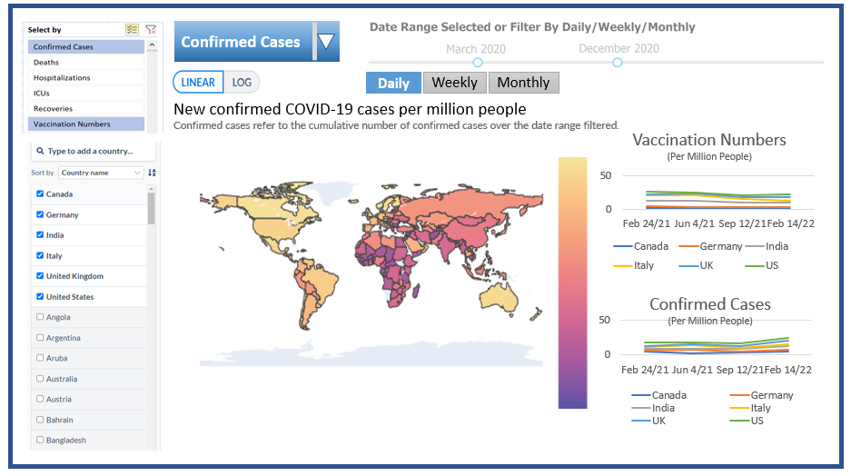

# World COVID-19 Dashboard (Python)

## Overview

The World COVID-19 Dashboard is an interactive app that allows users to explore COVID-19 confirmed cases, deaths, recoveries, and vaccinations around the world. The data is presented in the format of linear and logarithmic scales for purpose of illustrating trends over different time periods. The intent of this app is for users to quickly learn the current pandemic situation as COVID-19 spreads from country to country across the world. While we adapt to live with COVID-19 and escape from the pandemic, and our dashboard can clearly show you COVID-19 data summaries and vaccination numbers. 

Our app is middled by a world map for COVID-19 numbers; on the left side of the dashboard, the user can view confirmed cases, number of deaths and vaccinations for selected countries in the filter; on the right side of the dashboard, the statistics for selected countries are visually presented in line charts with a filter for daily, weekly, monthly, and yearly data presentation.

The complete COVID-19 dataset used in our dashboard can be downloaded in [CSV](https://covid.ourworldindata.org/data/owid-covid-data.csv) | [XLSX](https://covid.ourworldindata.org/data/owid-covid-data.xlsx) | [JSON](https://covid.ourworldindata.org/data/owid-covid-data.json) and this is a collection of the COVID-19 data maintained by [_Our World in Data_](https://ourworldindata.org/coronavirus).

## Dashboard Design

## License

The World COVID-19 Dashboard was created by Adam Morphy, Kingslin Lv, Thomas Siu, and Kristin Bunyan. It is licensed under the terms of the MIT license.

## Contributors
### Development Lead

| Member        | Github                                            |
|---------------|---------------------------------------------------|
| Adam Morphy   | [adammorphy](https://github.com/adammorphy)       |
| Kingslin Lv   | [Kingslin0810](https://github.com/Kingslin0810)   |
| Kristin Bunyan| [khbunyan](https://github.com/khbunyan)           |
| Thomas Siu    | [thomassiu](https://github.com/thomassiu)         |

We welcome and recognize all contributions. Please find the guide for contribution in [Contributing Document](https://github.com/UBC-MDS/group10-worldcovid-dashpython/blob/main/CONTRIBUTING.md).

## References

COVID-19 Data Repository by [Our World Data](https://ourworldindata.org/coronavirus) at University of Oxford. This data has been collected, aggregated, and documented by Cameron Appel, Diana Beltekian, Daniel Gavrilov, Charlie Giattino, Joe Hasell, Bobbie Macdonald, Edouard Mathieu, Esteban Ortiz-Ospina, Hannah Ritchie, Lucas Rodés-Guirao, and Max Roser.
