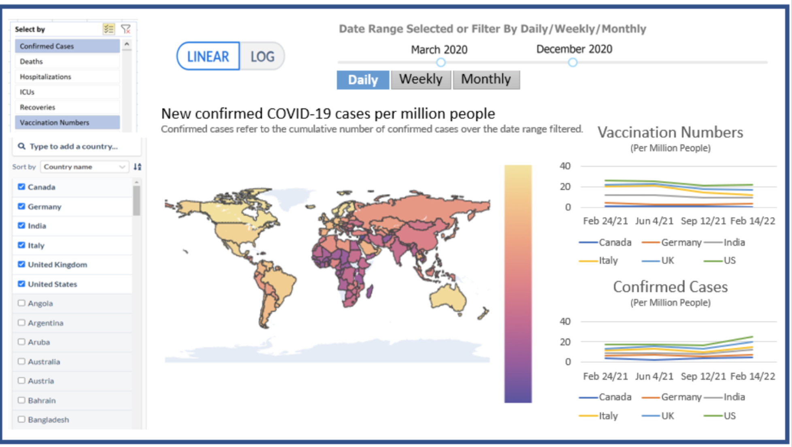

# World COVID-19 Dashboard (Python)

## Overview

The World COVID-19 Dashboard is an interactive app that allows users to explore global COVID-19 indicators The intent of this app is for users to quickly observe and understand the current state of the pandemic situation as globally, and compare different metrics across different countries. As we all adjust to living with COVID-19, our dashboard serves as a tool that can clearly demonstrate the movement of the pandemic over time through data summaries and visualizations. 

Design (sketch pictured below): 
- Our app is centered by a world map showing the number of new COVID-19 cases by country. 
- The left-hand side of the dashboard contains the user's main feature filters. There, the user can select up to two of the following features for the line chart visualizations on the right of the map: total_cases, new_cases, total_deaths, new_deaths, hosp_patients (hospitalized patients), icu_patients, people_vaccinated, and people_fully_vaccinated. 
- As mentioned above, the right-hand side of the dashboard, displays two line chart visualizations based on the features selected by the user.
- The top of the app contains the main data filters. The user can filter for logarithmic or linear data, as well as choose the level of granularity they wish to explore: daily, monthly, or weekly. This also contains our date-time slider, that allows the user to filter for a particular time period they would like to see.

The deatiled proposal can be found [here](https://github.com/UBC-MDS/group10-worldcovid-dashpython/blob/main/docs/proposal.md)

The complete COVID-19 dataset used in our dashboard can be downloaded in [CSV](https://covid.ourworldindata.org/data/owid-covid-data.csv) | [XLSX](https://covid.ourworldindata.org/data/owid-covid-data.xlsx) | [JSON](https://covid.ourworldindata.org/data/owid-covid-data.json) and this is a collection of the COVID-19 data maintained by [_Our World in Data_](https://ourworldindata.org/coronavirus).

## Dashboard Design

## License

The World COVID-19 Dashboard was created by Adam Morphy, Kingslin Lv, Thomas Siu, and Kristin Bunyan. It is licensed under the terms of the MIT license.

## Contributors
### Development Lead

| Member        | Github                                            |
|---------------|---------------------------------------------------|
| Adam Morphy   | [adammorphy](https://github.com/adammorphy)       |
| Kingslin Lv   | [Kingslin0810](https://github.com/Kingslin0810)   |
| Kristin Bunyan| [khbunyan](https://github.com/khbunyan)           |
| Thomas Siu    | [thomassiu](https://github.com/thomassiu)         |

We welcome and recognize all contributions. Please find the guide for contribution in [Contributing Document](https://github.com/UBC-MDS/group10-worldcovid-dashpython/blob/main/CONTRIBUTING.md).

## References

COVID-19 Data Repository by [Our World Data](https://ourworldindata.org/coronavirus) at University of Oxford. This data has been collected, aggregated, and documented by Cameron Appel, Diana Beltekian, Daniel Gavrilov, Charlie Giattino, Joe Hasell, Bobbie Macdonald, Edouard Mathieu, Esteban Ortiz-Ospina, Hannah Ritchie, Lucas Rodés-Guirao, and Max Roser.
